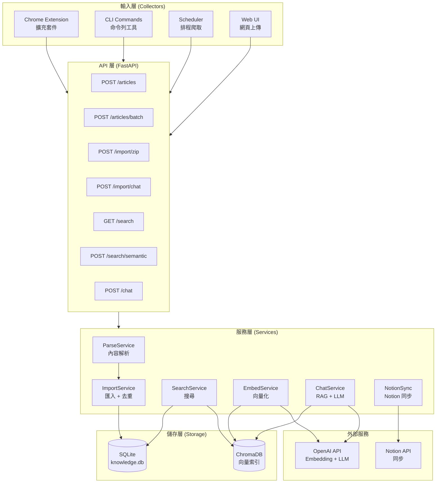
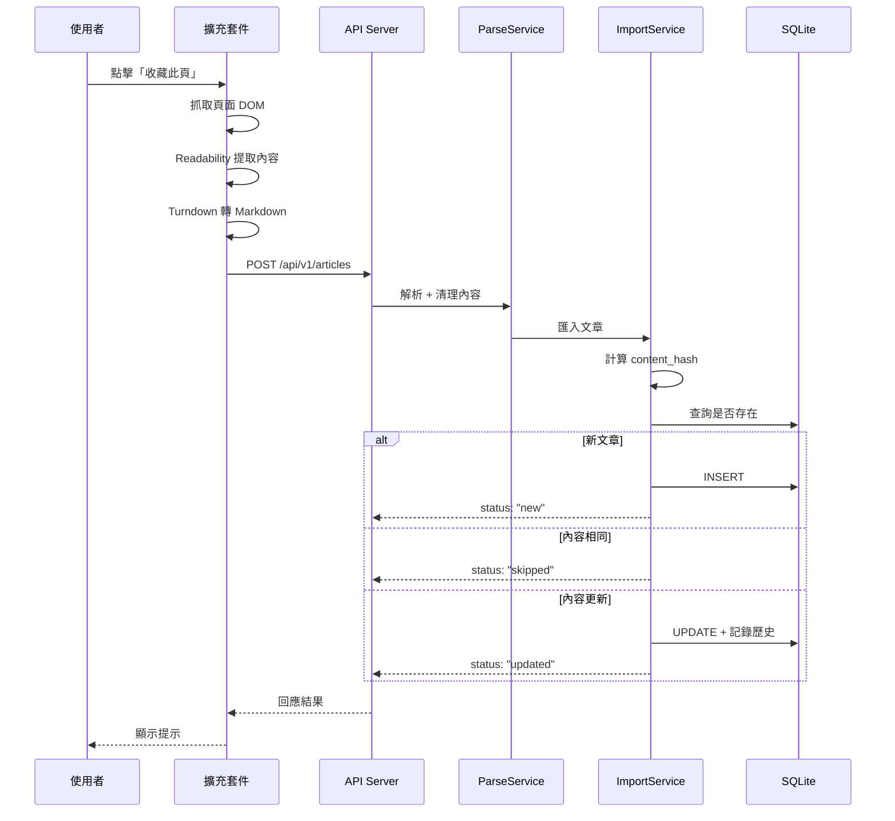
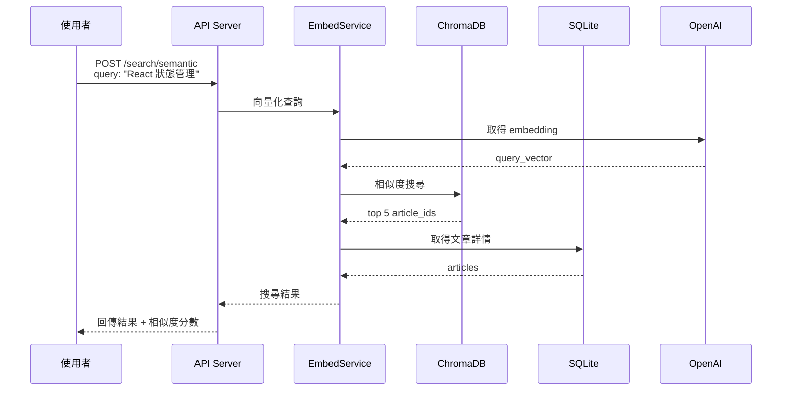
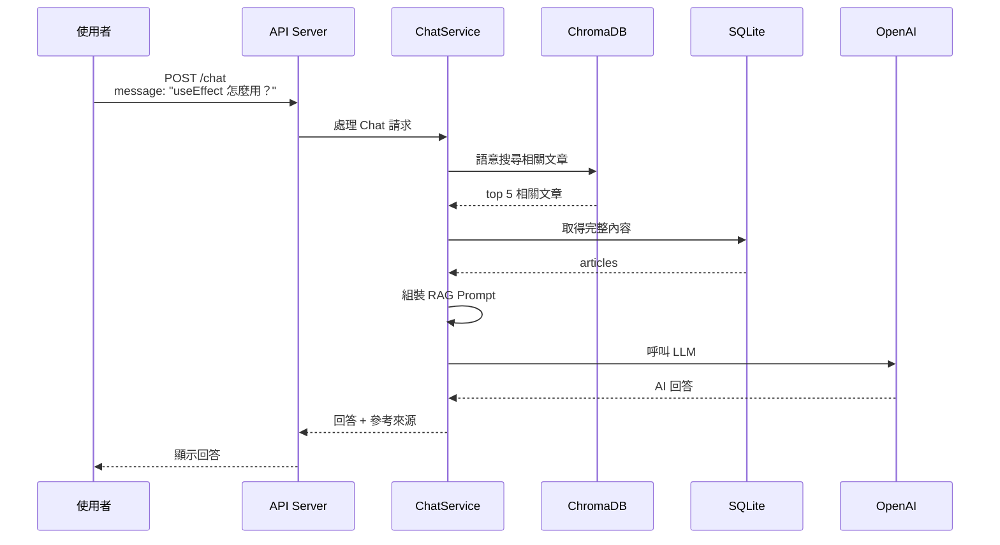
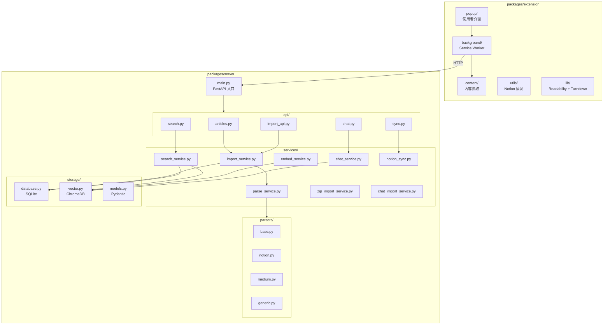
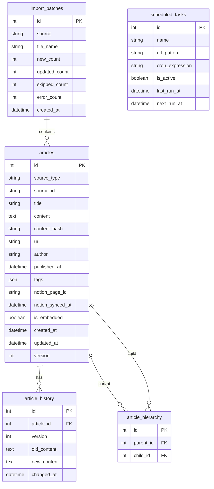
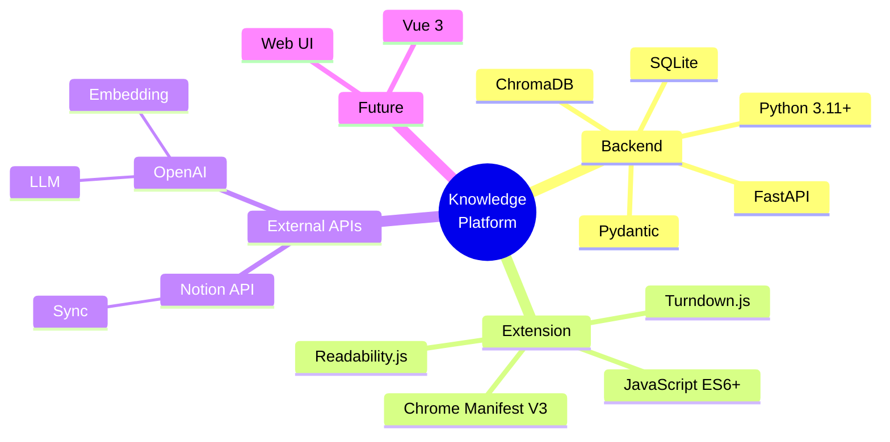

# Knowledge Platform - 系統架構

> 本文件描述系統的整體架構、資料流與模組關係。

---

## 1. 高層架構圖



---

## 2. 資料流圖

### 2.1 收藏單頁流程



### 2.2 語意搜尋流程



### 2.3 Chat (RAG) 流程



---

## 3. 模組關係圖



---

## 4. 資料模型

### 4.1 ER 圖



### 4.2 主要欄位說明

| 欄位 | 說明 |
|------|------|
| `source_type` | 來源類型：notion / medium / docs / web / claude-code / cursor |
| `source_id` | 來源唯一識別碼（URL hash 或頁面 ID 或對話 ID） |
| `content_hash` | 內容的 MD5 hash，用於偵測變更 |
| `is_embedded` | 是否已向量化 |
| `version` | 版本號，每次更新 +1 |

---

## 5. 技術棧



---

## 6. 部署架構

### 6.1 本地開發

```
┌─────────────────────────────────────────────────────────────┐
│                     本地開發環境                             │
├─────────────────────────────────────────────────────────────┤
│                                                             │
│   ┌─────────────┐     ┌─────────────┐                      │
│   │   Chrome    │────▶│   FastAPI   │                      │
│   │  Extension  │     │  localhost  │                      │
│   │             │     │    :8000    │                      │
│   └─────────────┘     └──────┬──────┘                      │
│                              │                              │
│                    ┌─────────┴─────────┐                   │
│                    │                   │                   │
│               ┌────▼────┐        ┌─────▼─────┐            │
│               │ SQLite  │        │ ChromaDB  │            │
│               │ ./data/ │        │  ./data/  │            │
│               └─────────┘        └───────────┘            │
│                                                             │
└─────────────────────────────────────────────────────────────┘
```

### 6.2 外部服務連接

```
┌─────────────────────────────────────────────────────────────┐
│                      外部服務連接                            │
├─────────────────────────────────────────────────────────────┤
│                                                             │
│   本地服務                          外部 API                 │
│   ────────                          ────────                │
│                                                             │
│   ┌─────────────┐                 ┌─────────────┐          │
│   │   FastAPI   │───Embedding────▶│   OpenAI    │          │
│   │   Server    │───LLM Call─────▶│    API      │          │
│   └──────┬──────┘                 └─────────────┘          │
│          │                                                  │
│          │                        ┌─────────────┐          │
│          └───Sync────────────────▶│   Notion    │          │
│                                   │    API      │          │
│                                   └─────────────┘          │
│                                                             │
│   連接為選用，核心功能可離線運作                             │
│                                                             │
└─────────────────────────────────────────────────────────────┘
```

---

## 7. 安全考量

```
┌─────────────────────────────────────────────────────────────┐
│                      安全設計                                │
├─────────────────────────────────────────────────────────────┤
│                                                             │
│   ✅ API Keys 只存在本地 .env，不上傳 Git                   │
│   ✅ 資料庫存在本地，使用者完全掌控                          │
│   ✅ 不追蹤使用者行為                                       │
│   ✅ Notion 同步為選用功能                                  │
│   ✅ 擴充套件只與 localhost 通訊                            │
│                                                             │
│   ⚠️ 注意事項：                                             │
│   • 不要將 .env 提交到版本控制                              │
│   • 不要在公開網路暴露 API Server                           │
│   • 定期備份 data/ 目錄                                     │
│                                                             │
└─────────────────────────────────────────────────────────────┘
```

---

## 8. 擴展指南

### 8.1 新增 Parser

```python
# 1. 建立新檔案 parsers/new_site.py
from .base import BaseParser, ParsedContent

class NewSiteParser(BaseParser):
    def can_parse(self, url: str) -> bool:
        return "newsite.com" in url

    def parse(self, html: str, url: str) -> ParsedContent:
        # 實作解析邏輯
        ...

# 2. 在 parsers/__init__.py 註冊
from .new_site import NewSiteParser
PARSERS = [..., NewSiteParser()]
```

### 8.2 新增儲存目標

```python
# 1. 建立新檔案 storage/new_storage.py
class NewStorage:
    def save(self, article: Article) -> str:
        ...

    def query(self, **kwargs) -> list[Article]:
        ...

# 2. 在 services/ 中整合
```
